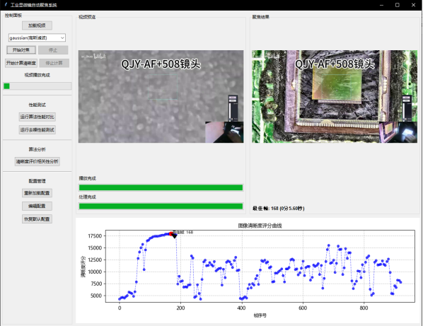

# 工业显微镜自动聚焦系统

[](https://www.python.org/)
[](https://opencv.org/)
[](LICENSE)

**项目演示**  
 <!-- 需替换实际截图路径 -->

## 项目简介
面向工业显微镜图像开发的全自动聚焦系统，实现：
- 🎯 智能图像去噪与增强
- 📊 多指标清晰度评价
- ⚡ 快速分层对焦算法
- 📈 可视化分析与测试工具

## 主要功能
| 模块 | 功能 | 关键文件 |
|------|------|----------|
| **图像预处理** | 噪声检测/滤波/对比度增强 | `preprocessing.py` |
| **对焦算法** | 粗-精两阶段搜索/多线程加速 | `autofocus.py` |
| **评分系统** | 方差+梯度混合评价模型 | `focus_eval.py` |
| **可视化界面** | 实时双视图/进度监控/曲线分析 | `interface.py` |
| **性能测试** | 算法对比/耗时分析 | `performance_test.py` |

## 快速开始
### 环境安装
```bash
# 安装依赖库
pip install -r requirements.txt
# 典型依赖包括：
# opencv-python==4.5.5.64
# numpy==1.21.5
# matplotlib==3.5.1
# PyYAML==6.0
```

### 配置文件
修改`config.yaml`调整核心参数：
```yaml
processing:
  preprocessing:
    target_size: [1024, 1024]  # 图像缩放尺寸
  denoise:
    thresholds:  # 噪声等级判定阈值
      light: 500
      medium: 1000

autofocus:
  coarse_step: 5  # 粗搜索步长
```

### 启动系统
```bash
python interface.py
```

## 关键特性
- **智能参数适配**  
  根据图像亮度自动调整评分权重（参见`focus_eval.py`第78-80行）
- **高效并行计算**  
  利用线程池加速多帧处理（`autofocus.py`第28-40行）
- **模块化测试框架**  
  通过继承`BaseTester`快速扩展测试项（参考`performance_test.py`）

## 文档目录
```
├── config.yaml        # 系统参数配置
├── core/              # 核心算法模块
│   ├── preprocessing.py  # 图像预处理
│   └── focus_eval.py     # 清晰度评价
├── test/              # 测试工具集
│   ├── base_tester.py    # 测试基类
│   └── performance_test.py # 性能对比
└── interface.py       # 主界面程序
```

## 问题反馈
如有使用问题或改进建议，请提交[Issues](https://github.com/yourname/project/issues) ✍️
